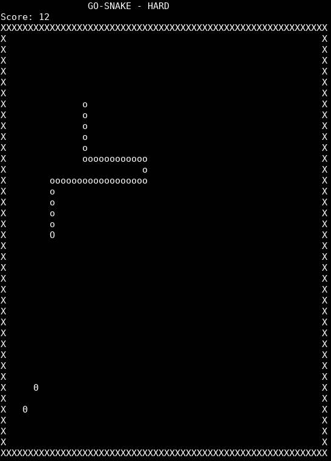
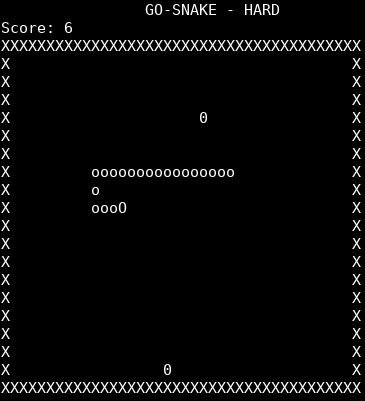

# gosnake
## What is this?
This is a simple snake ASCII snake game you can play when you are really bored by everything.
It is so minimal, that it doesn't even have a highscore...

Screenshot1			  | Screenshot2
:--------------------------------:|:--------------------------------:
	  | 

## How do I play this?
Control the snake with the arrow keys.
Pause with 'p'.
Close the game with 'ESC'
There are no real ingame options but here are some command line options: 
- `-size` -> set game table size (don't make it to big or it gets to easy) 
- `-difficulty` -> set game difficulty (options are: easy, medium, hard, impossible)

## How to install
To use this repository just clone it:
`git clone https://github.com/handsome-max/gosnake.git`
Then just run the exectutable.
If you want to run/build it yourself with
`go run` or `go build`
you have to set up a go Workspace.
Basically you have to create a folder struction like this:
> go
> > src
> > > gosnake

Where gosnake is exactly this repository.

After this all you have to do is install go and setup your *GOPATH* variable
f.e. `export $GOPATH=$HOME/go/`
If you want to have your GO-Workspace under your home. But read more for this on the official [golang setup guide](https://golang.org/doc/install#install "Go installation guide").

## TODO:
- implement highscore saving
- user defined game characters
- balance difficulties
- mode with open borders -> no wall collision but teleport to opposite site
- 2 player mode?

